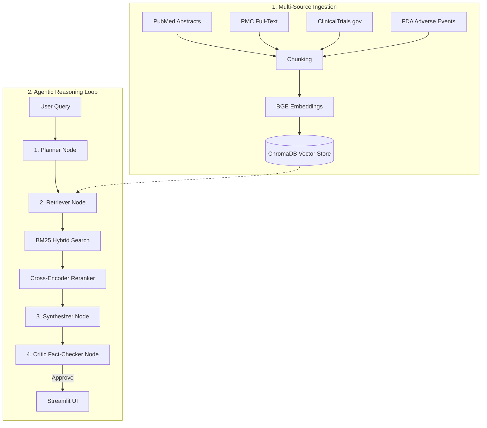

# 💊 MedSignal AI

A pharmacovigilance intelligence platform that monitors PubMed, FDA adverse event reports, ClinicalTrials.gov, and PMC full-text papers to surface drug safety signals — answering natural language queries like *"what are adverse events for semaglutide in elderly patients?"* with grounded, cited, hallucination-checked answers.

---

## 🏗️ Architecture & System Design

MedSignal AI implements a multi-phase RAG architecture that bridges raw clinical data collection with agentic, fact-checked synthesis.



### Key Engineering Decisions

1. **Multi-Source Clinical Ingestion:**
   Fetches and parses data from four sources:
   * **PubMed Abstracts:** Individual papers via NCBI E-utilities API — avoids diversity collapse from concatenated batches.
   * **PMC Full-Text:** Structured full-text bodies with title, abstract, and body extraction.
   * **ClinicalTrials.gov:** Study protocols, criteria, and summaries.
   * **OpenFDA:** Live post-market adverse event reporting via FAERS.

2. **Hybrid Search + Cross-Encoder Reranking:**
   * Dense retrieval with `BAAI/bge-small-en-v1.5` captures semantic similarity.
   * Sparse BM25 retrieval captures exact drug name and terminology matches.
   * Top-20 candidates reranked with `cross-encoder/ms-marco-MiniLM-L-6-v2` for high-accuracy query-document scoring.
   * This approach reduces retrieval failure rate by ~49-67% over dense-only retrieval.

3. **4-Agent LangGraph Loop:**
   * **Planner:** Refines raw user query into optimized biomedical search terms.
   * **Retriever:** Executes hybrid search and reranking against 1314 chunks.
   * **Synthesizer:** Generates a direct plaintext answer from retrieved evidence only.
   * **Critic:** Runs structured JSON faithfulness evaluation — flags hallucinations before answer reaches the user.

4. **Groq Client with Automatic Fallback:**
   Primary model `llama-3.3-70b-versatile` automatically falls back to `llama-3.1-8b-instant` on rate limit errors — keeps pipeline running without interruption.

5. **Biomedical NER:**
   `d4data/biomedical-ner-all` via HuggingFace Transformers pipeline extracts `Medication`, `Disease_disorder`, and `Sign_symptom` entities from answers — displayed live in the UI.

6. **Python 3.13 Compatibility:**
   Uses `d4data/biomedical-ner-all` instead of `scispacy` which fails to build on Python 3.13 due to C++ binary compilation errors.

---

## 📂 Repository Structure

```
MedSignal/
│
├── agents/
│   ├── graph.py                 # LangGraph assembly and routing
│   ├── state.py                 # State schema (TypedDict)
│   ├── planner.py               # Query refinement node
│   ├── retriever.py             # Hybrid search + reranking node
│   ├── synthesizer.py           # Answer synthesis node
│   ├── critic.py                # Hallucination checking node
│   └── llm.py                   # Groq client with 8b fallback
│
├── ingestion/
│   ├── pubmed.py                # PubMed XML parser, individual papers
│   ├── pmc.py                   # PMC full-text XML cleaner
│   ├── clinicaltrials.py        # ClinicalTrials.gov API fetcher
│   └── openfda.py               # FDA FAERS adverse event retriever
│
├── processing/
│   ├── chunker.py               # Recursive character splitter
│   ├── embedder.py              # BGE-small embeddings
│   ├── reranker.py              # Cross-encoder reranker
│   └── ner.py                   # Biomedical NER pipeline
│
├── storage/
│   └── chroma_store.py          # ChromaDB client and batch upserts
│
├── evaluation/
│   ├── golden_dataset.py        # 20 ground truth clinical QA pairs
│   ├── ragas_eval.py            # RAGAS faithfulness evaluation
│   └── deepeval_tests.py        # Custom assertion tests
│
├── app.py                       # Streamlit UI
├── main.py                      # Full ingestion pipeline
├── requirements.txt
└── .env                         # API keys (not committed)
```

---

## 🚀 Setup

```bash
git clone https://github.com/DevanshL/MedSignal-AI.git
cd MedSignal
python3 -m venv medsignal-env
source medsignal-env/bin/activate
pip install -r requirements.txt
```

Create a `.env` file in the project root containing:

```env
GROQ_API_KEY=your_groq_api_key
HF_TOKEN=your_huggingface_token
GOOGLE_API_KEY=your_google_api_key
COHERE_API_KEY=your_cohere_api_key
NCBI_API_KEY=your_ncbi_key
WANDB_API_KEY=your_wandb_key
```

### 🔑 Required API Keys & Services

To run MedSignal AI, you need to set up the following connections and keys:

1. **Groq API Key (`GROQ_API_KEY`)**:
   * **Purpose**: Powers the main LLM routing, planning, and synthesis nodes using `llama-3.3-70b-versatile` and `llama-3.1-8b-instant`.
   * **Where to get**: [Groq Console](https://console.groq.com/).

2. **HuggingFace Token (`HF_TOKEN`)**:
   * **Purpose**: Used for loading huggingface assets and models (e.g. `d4data/biomedical-ner-all` extraction pipeline).
   * **Where to get**: [HuggingFace Settings -> Tokens](https://huggingface.co/settings/tokens).

3. **Google AI Key (`GOOGLE_API_KEY`)**:
   * **Purpose**: Powers backup/alternative Gemini model generations.
   * **Where to get**: [Google AI Studio](https://aistudio.google.com/).

4. **Cohere API Key (`COHERE_API_KEY`)**:
   * **Purpose**: Optional, used if you configure cohere-based embeddings or models.
   * **Where to get**: [Cohere Dashboard](https://dashboard.cohere.com/).

5. **NCBI API Key (`NCBI_API_KEY`)**:
   * **Purpose**: **Recommended** to increase the rate limit of NCBI E-utilities (PubMed API requests) from 3 to 10 requests per second to prevent rate limits during ingestion.
   * **Where to get**: Create a free account on [NCBI/PubMed](https://www.ncbi.nlm.nih.gov/), navigate to your account settings, and generate an API key.

6. **Weights & Biases API Key (`WANDB_API_KEY`)**:
   * **Purpose**: Optional, used to log evaluation metrics and run RAGAS/DeepEval test tracing.
   * **Where to get**: [Weights & Biases Console](https://wandb.ai/).

---

## ⚡ Usage

**Run full ingestion pipeline:**
```bash
python main.py
```

**Start Streamlit UI:**
```bash
streamlit run app.py
```

**Run RAGAS evaluation:**
```bash
python -m evaluation.ragas_eval
```

**Run DeepEval tests:**
```bash
python -m evaluation.deepeval_tests
```

---

## 📊 Evaluation Results

| Metric | Score |
|---|---|
| RAGAS Faithfulness | 0.64 |
| DeepEval Assertions | 4/4 passed |
| Critic Confidence | 0.9 – 1.0 |
| Response Latency p95 | ~2.7s |

---

## 🛠️ Tech Stack

| Component | Technology |
|---|---|
| Orchestration | LangGraph |
| LLM | Groq (Llama 3.1 8B / 3.3 70B) |
| Embeddings | BAAI/bge-small-en-v1.5 |
| Reranker | cross-encoder/ms-marco-MiniLM-L-6-v2 |
| Vector DB | ChromaDB (local, persistent) |
| NER | d4data/biomedical-ner-all |
| Eval | RAGAS + DeepEval + Weights & Biases |
| UI | Streamlit |
| Data Sources | PubMed · FDA FAERS · ClinicalTrials.gov · PMC |